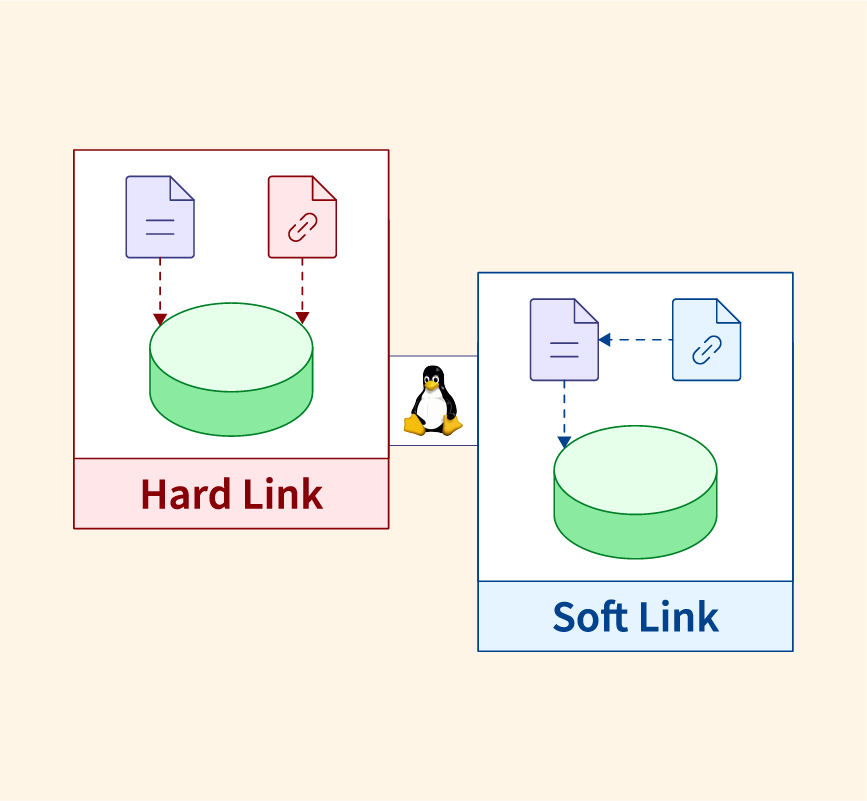
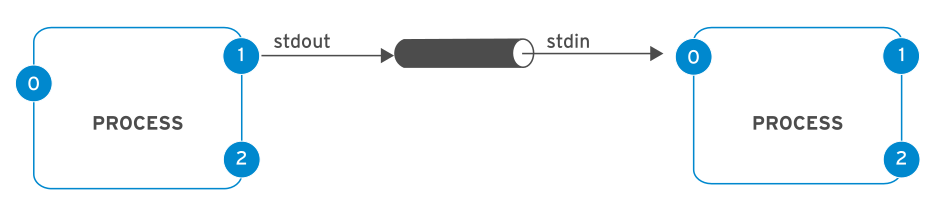

## Agenda
- [1.Finding Files](##1.-finding-files)
- [2.File Compression and Archiving](##2.-file-compression-and-archiving)
- [3. Creating Links Between Files](##3.-creating-links-between-files)
- [4. Redirecting Output](##4.-redirecting-ooutput)
- [5. Pipeline](##5.-pipeline)

## 1. Finding Files

Learn how to locate files and directories efficiently using various command-line tools:

- **`find`**: Search for files in a directory hierarchy.
  - Syntax: `find [path] [options] [expression]`
  - Examples:
    - `find /home/user -name "file.txt"`: Find `file.txt` in `/home/user` and its subdirectories.
    
    - `find /var/log -type f -mtime -7`: Find files in `/var/log` modified in the last 7 days.
    
    - `find /home/user -iname file`: Find `file` in `/home/user` and its subdirectories. Searches for files with a specific
       pattern name or pattern, regardless of case..
       
    - `find /home/osc/ -type d -name task-1`: Find directories in `/home/osc/` 
  

## 2. File Compression and Archiving
### Archiving
Archiving is the process of combining multiple files and directories into a single file. It does not necessarily reduce the file size.
**Purpose:**
- Consolidate multiple files and directories into one file for easier management or backup.

### Compressing
Compressing reduces the size of files by encoding them more efficiently. This can be applied to individual files or archives.
**Purpose:**
- Reduce file size for saving storage space or faster transmission over networks.

Understand how to compress and archive files to save space and organize them:

- **`tar`**: Archive files into a single file.
  - Syntax: `tar [options] [archive-file] [files to be archived]`
  - Examples:
    - `tar -cvf archive.tar file1 file2`: Create an archive `archive.tar` with `file1` and `file2`.
    - `tar -xvf archive.tar`: Extract files from `archive.tar`.
    - `tar -czf archive.tar file1 file2`: Create an archive and compress gzip `archive.tar` with `file1` and `file2`.
    - `tar -cjf archive.tar file1 file2`: Create an archive and compress bzip2 `archive.tar` with `file1` and `file2`.
    - `tar -tvf archive.tar`: This lists all files and directories within `archive.tar` without extracting them.

- **`gzip`** and **`gunzip`**: Compress and decompress files using gzip.
  - Syntax: `gzip [file]` or `gunzip [file.gz]`
  - Example: `gzip file.txt` (creates `file.txt.gz`), `gunzip file.txt.gz` (extracts `file.txt`).

- **`bzip2`** and **`bunzip2`**: Compress and decompress files using bzip2.
  - Syntax: `bzip2 [file]` or `bunzip2 [file.bz2]`
  - Example: `bzip2 file.txt` (creates `file.txt.bz2`), `bunzip2 file.txt.bz2` (extracts `file.txt`).

- **`zip`** and **`unzip`**: Create and extract ZIP archives.
  - Syntax: `zip [options] [archive.zip] [files]` or `unzip [archive.zip]`
  - Example: `zip archive.zip file1 file2`, `unzip archive.zip`

## 3. Creating Links Between Files

Explore how to create hard and symbolic links:

- **`ln`**: Create hard and symbolic links.
  - Syntax: `ln [options] [target] [link-name]`
  - Examples:
    - `ln file1 link-to-file1`: Create a hard link to `file1`.
    - `ln -s /path/to/file link-to-file`: Create a symbolic link to `/path/to/file`.

- **Hard Links**: Direct pointers to the same inode.
  - Use `ln` without `-s`.
  - Example: `ln file1 hardlink-to-file1`

- **Symbolic Links**: Pointers to the file path (like shortcut in windows).
  - helps in saving disk space by allowing multiple references to the same file content.
  - Use `ln -s`.
  - Example: `ln -s /path/to/file symbolic-link`
  
  
  - use `unlink [link-file]`: delete link between original and linked 
  - use `rm [link-file]`: remove link-file 

### difference between soft and hard link

## 4. Redirecting Output

### standard input-output 

Learn how to redirect and manage command output:

- **Output Redirection**:
  - `>`: Redirect output to a file, overwriting it.
    - Example: `echo "Hello" > file.txt`
  - `>>`: Append output to a file.
    - Example: `echo "World" >> file.txt`

- **Error Redirection**:
  - `2>`: Redirect error messages to a file.
    - Example: `command 2> error.log`
  - `2>>`: Append error messages to a file.
    - Example: `command 2>> error.log`
  - `&>`: Redirect both stdout and stderr to a file.
    - Example: `command &> output.log`
    
## 5. Pipeline
  - `|`: Pass the output of one command as input to another.

- Example: `ls | tee fileNames.txt`: Display the output of a command on the terminal (standard output) and Write the same output to a file you specify.

- Ex: `ls | wc`: Counting lines, words, and characters in multiple files:

